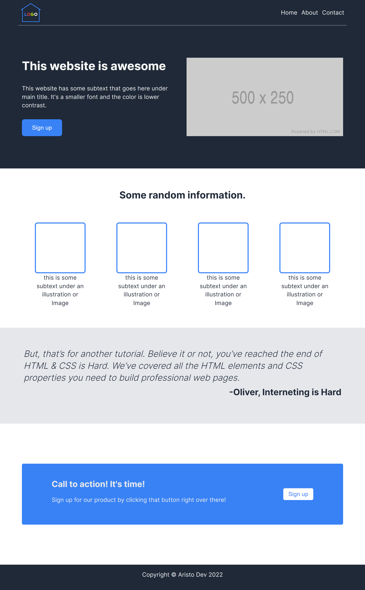
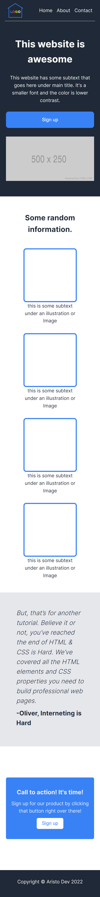

# The Odin Project Landing Page  

## Table of contents

- [Overview](#overview)
  - [Screenshot](#screenshot)
  - [Links](#links)
- [My process](#my-process)
  - [Built with](#built-with)
- [Author](#author)

## Overview

### Screenshot

### Links

- [Live Site URL](https://aristodev22.github.io/top-landing-page/)

## My process

### Built with

- Semantic HTML5 markup
- Flexbox CSS
- Responsive layout with mobile, tablet and desktop versions
- Mobile first approach
- Fluid scaling of padding and typography without media queries
- Efficient use of calc(), clamp() and relatives units like rem and vw.

## Author

- Website - [Aristo Dev](https://www.aristodev.com)
- Frontend Mentor - [@AristoDev22](https://www.frontendmentor.io/profile/aristodev22)
- Twitter - [@AristoDev22](https://www.twitter.com/aristodev22)